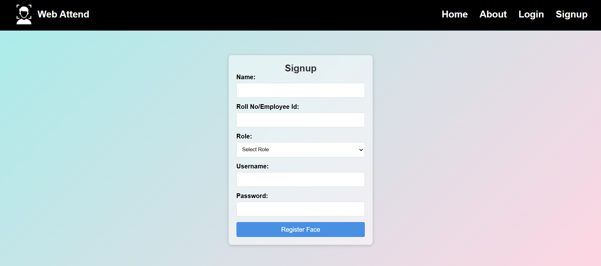
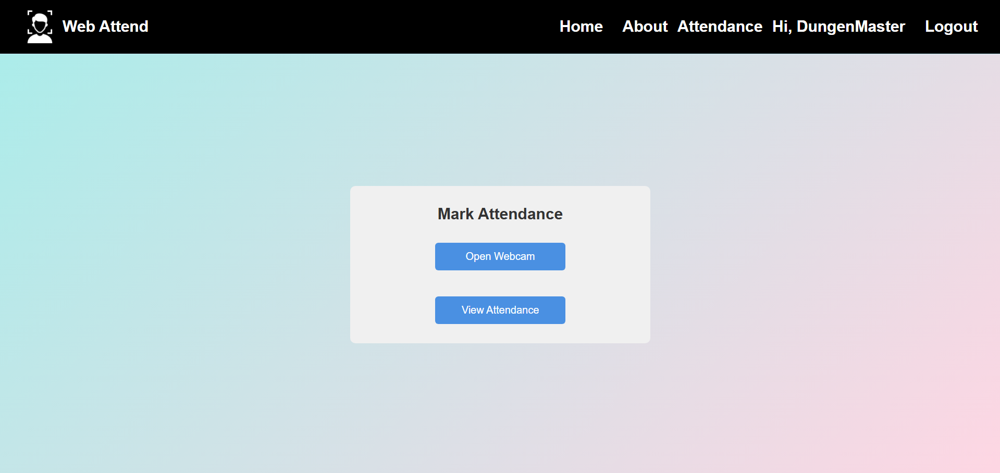
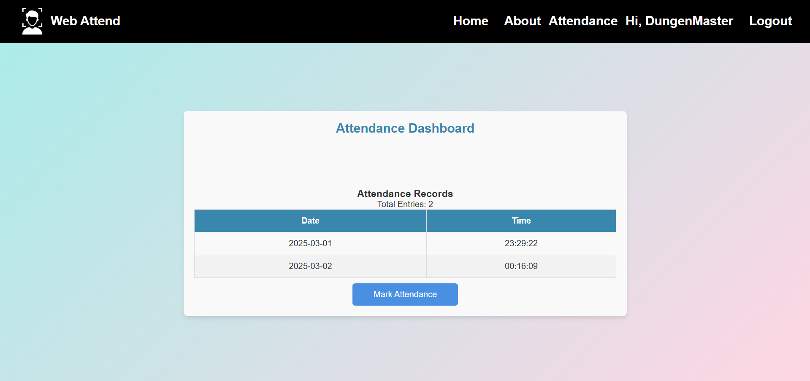

**Web-Attend** is an AI-powered **face recognition attendance system** for employees and students. It provides a secure and automated way to mark attendance using **facial biometrics**, with additional features for remote and in-office attendance tracking.  

## Features  
- **Face Recognition** – Marks attendance by scanning faces  
- **Remote & Office Work Tracking** – Employees can check in remotely using a key based sytem
- **Dashboard** – Users can view their attendance records  
- **Secure & Reliable** – Built with **React, Flask, Node, Redis, and OpenCV**  

---

## Installation & Setup  

### 1️⃣ Clone the Repository  
```bash
git clone https://github.com/yourusername/Web-Attend.git
cd Web-Attend
```
### 2️⃣ Install Frontend Dependencies
```bash
npm install
cd src
npm run dev
```
### 2️⃣ Install Frontend Dependencies
```bash
cd backend
pip install -r requirements.txt
python app.py
```
### 4️⃣ Run Redis for Session Management
- Make sure Redis is installed and running. Start it using:
```bash
sudo service redis-server start
```
### 5️⃣ Access the Application
- Open http://localhost:3000 to access the frontend


## Project Images   

### Face Recognition Demo  
  

### User Login  
  

### Attendance Marking  
  

### Dashboard  
 
